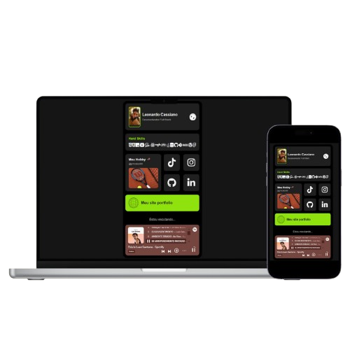

# Imagem do Projeto

# Meus Links - Leonardo Cassiano │Dev

Este é um site pessoal desenvolvido por Leonardo Cassiano para centralizar links importantes e destacar habilidades e projetos. A página inclui widgets com informações pessoais, habilidades técnicas, links para redes sociais, e muito mais.

## Características

- **Loading Screen Customizado:** Uma tela de carregamento animada que mostra o progresso em porcentagem até que o site esteja completamente carregado.
- **Perfil do Usuário:** Informações do desenvolvedor com foto, nome e título.
- **Habilidades Técnicas:** Ícones de tecnologias que destacam as hard skills do desenvolvedor.
- **Links para Redes Sociais:** Links diretos para TikTok, Instagram, GitHub e LinkedIn.
- **Portfólio e Freelancer:** Links para o site de portfólio pessoal e um site com recursos para freelancers.

## Tecnologias Utilizadas

- HTML5
- CSS3
- JavaScript
- FontAwesome para ícones
- Roboto Font do Google Fonts

## Como Usar

1. Clone o repositório em sua máquina local usando `git clone [URL do Repositório]`.
2. Abra o arquivo `index.html` em um navegador para visualizar o site.
3. Explore as diferentes seções clicando nos links e ícones disponíveis.

## Contribuições

Contribuições são sempre bem-vindas! Se você tem alguma sugestão para melhorar este projeto, sinta-se à vontade para fazer um fork do repositório e enviar sua pull request.

## Autor

**Leonardo Cassiano**
- [Perfil no GitHub](https://github.com/yLeonardo99)
- [LinkedIn](https://www.linkedin.com/in/leonardo-cassiano-435b62257/)
- [Instagram](https://www.instagram.com/p1csleo99/)
